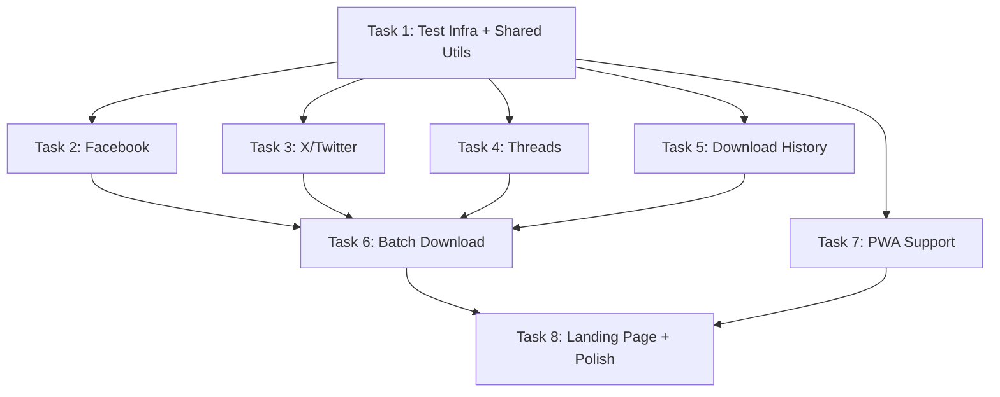

# SaveIt — Multi-Platform Expansion + Batch Download + History + PWA

## Background

SaveIt is a Next.js 16 video downloader app currently supporting **YouTube**, **TikTok**, and **Instagram**. It uses **yt-dlp** (via `yt-dlp-wrap`) as the backend download engine with server actions + route handlers for streaming downloads.

### Current Architecture Pattern (per platform)
```
src/core/services/{platform}.service.ts     → yt-dlp wrapper (getVideoInfo, createDownloadStream)
src/actions/{platform}-downloader.action.ts  → Server Actions (validate → call service → return download path)
src/app/{platform}/page.tsx                  → Server Component (metadata + imports client)
src/app/{platform}/{platform}-downloader.tsx → Client Component (URL input → fetch → quality → download)
src/app/internal/download/{platform}/route.ts → Route Handler (stream yt-dlp stdout as Response)
```

### Design System
- **Dark theme**: `bg-[#080808]`, glassmorphism (`glass` utility), Syne + DM Sans fonts
- **Styling**: Tailwind CSS v4 with custom utilities in `globals.css`
- **Each platform** has unique accent colors/gradients (red=YouTube, pink+cyan=TikTok, purple gradient=Instagram)
- **Shared shell**: `DownloaderShell` component wraps each downloader page

---

## User Review Required

> [!IMPORTANT]
> **yt-dlp Platform Support**: Research confirms yt-dlp has **full built-in extractors** for **Facebook** and **X/Twitter**. For **Threads** (threads.net), yt-dlp does **NOT** have a dedicated extractor — it falls back to the generic extractor which may fail on videos. We have two options:
> 1. **(Recommended)** Still use yt-dlp for Threads but with the generic extractor + fallback error handling. It works for some Threads video posts but not all.
> 2. Use the `universalDownloader` API as a fallback specifically for Threads only.
>
> **Recommendation**: Use yt-dlp for all 3 platforms (consistent architecture). Add clear error messaging for Threads when extraction fails. This avoids adding a third-party API dependency.

> [!WARNING]
> **Image-only posts** on Threads/Facebook/X: yt-dlp primarily extracts video. For image posts (especially multi-image carousels), yt-dlp returns limited data. The plan handles this with thumbnail extraction and image proxy routes, similar to the existing Instagram carousel approach.

## Open Questions

> [!IMPORTANT]
> 1. **Threads authentication**: Threads posts are often public but some may require login. Should we support cookie-based auth (like Instagram stories), or keep it public-only with a clear error message?
> 2. **Facebook authentication**: Many Facebook videos are public, but some are friends-only. Same question — public-only or cookie support?
> 3. **Download history storage**: The plan uses **localStorage** (client-side only, no backend database needed). Is this acceptable, or do you want server-side storage (would need a database)?
> 4. **PWA scope**: Should the PWA work fully offline (caching all pages), or just support "Add to Home Screen" with basic offline fallback?

---

## Proposed Changes — 8 Self-Contained Tasks

Each task is designed to be **independently executable** in a single session. Tasks are ordered by dependency (Task 1 must be done first, Tasks 2-4 are independent, etc.).

---

### Task 1: Test Infrastructure + Shared Utilities Refactoring

Set up the testing framework and extract duplicated utilities into shared modules. This is the foundation for TDD in all subsequent tasks.

#### [NEW] [jest.config.ts](file:///c:/laragon/www/video-downloader/jest.config.ts)
- Jest + ts-jest configuration for Next.js
- Module path aliases (`@/` → `src/`)
- Separate test environments: `node` for services/actions, `jsdom` for components

#### [NEW] [src/core/utils/format-helpers.ts](file:///c:/laragon/www/video-downloader/src/core/utils/format-helpers.ts)
- Extract duplicated `fmtDuration()`, `fmtCount()`, `fmtBytes()` from YouTube/TikTok/Instagram downloaders
- Extract shared `Spinner` component → `src/components/ui/spinner.tsx`
- Extract shared `withTimeout()` utility from all 3 services

#### [NEW] [src/core/utils/url-validators.ts](file:///c:/laragon/www/video-downloader/src/core/utils/url-validators.ts)
- Centralized URL validation for all 6 platforms
- `isPlatformUrl(url: string): PlatformType | null` — auto-detect platform from URL
- Individual validators: `isValidThreadsUrl`, `isValidFacebookUrl`, `isValidTwitterUrl`

#### [NEW] [src/core/utils/__tests__/format-helpers.test.ts](file:///c:/laragon/www/video-downloader/src/core/utils/__tests__/format-helpers.test.ts)
- Unit tests for all format helpers

#### [NEW] [src/core/utils/__tests__/url-validators.test.ts](file:///c:/laragon/www/video-downloader/src/core/utils/__tests__/url-validators.test.ts)
- Unit tests for all URL validators (valid/invalid patterns for all 6 platforms)

#### [MODIFY] [youtube-downloader.tsx](file:///c:/laragon/www/video-downloader/src/app/youtube/youtube-downloader.tsx)
- Replace local `fmtDuration`, `fmtCount`, `fmtBytes` with imports from shared utils

#### [MODIFY] [tiktok-downloader.tsx](file:///c:/laragon/www/video-downloader/src/app/tiktok/tiktok-downloader.tsx)
- Same refactoring as YouTube

#### [MODIFY] [instagram-downloader.tsx](file:///c:/laragon/www/video-downloader/src/app/instagram/instagram-downloader.tsx)
- Same refactoring as Instagram

**Tests to pass before moving on:**
```bash
pnpm test -- --testPathPattern="format-helpers|url-validators"
```

---

### Task 2: Facebook Platform Support

Add Facebook video/reel download support using yt-dlp's built-in `facebook` extractor.

#### [NEW] [src/core/services/facebook.service.ts](file:///c:/laragon/www/video-downloader/src/core/services/facebook.service.ts)
- `FacebookDownloaderService` class (follows YouTube/TikTok pattern)
- `getVideoInfo(url)` → yt-dlp `-J` with Facebook-specific headers
- `createDownloadStream(url, quality)` → pipe yt-dlp stdout
- URL cleaning: strip tracking params, normalize `fb.watch` short links
- Handle Facebook-specific formats: video-only, muxed, HD/SD variants
- Interface: `FacebookVideoInfo { id, title, thumbnail, duration, uploader, formats[], media_type }`

#### [NEW] [src/core/services/__tests__/facebook.service.test.ts](file:///c:/laragon/www/video-downloader/src/core/services/__tests__/facebook.service.test.ts)
- Unit tests for `cleanFacebookUrl()`, `isValidFacebookUrl()`
- Mock yt-dlp output tests for `getVideoInfo` parsing

#### [NEW] [src/actions/facebook-downloader.action.ts](file:///c:/laragon/www/video-downloader/src/actions/facebook-downloader.action.ts)
- `getFacebookInfoAction(url)` — validate + call service
- `prepareFacebookDownloadAction(url, quality, title)` — build download path

#### [NEW] [src/app/facebook/page.tsx](file:///c:/laragon/www/video-downloader/src/app/facebook/page.tsx)
- Server component with SEO metadata for Facebook downloader
- Imports `FacebookDownloader` client component

#### [NEW] [src/app/facebook/facebook-downloader.tsx](file:///c:/laragon/www/video-downloader/src/app/facebook/facebook-downloader.tsx)
- Client component following existing downloader pattern
- Accent colors: `from-blue-500 to-blue-600` (Facebook blue)
- Quality presets: HD, SD, Audio
- Facebook icon SVG

#### [NEW] [src/app/internal/download/facebook/route.ts](file:///c:/laragon/www/video-downloader/src/app/internal/download/facebook/route.ts)
- Route handler: validate URL → pipe `createDownloadStream` to Response

#### [MODIFY] [navbar.tsx](file:///c:/laragon/www/video-downloader/src/components/navbar.tsx)
- Add Facebook to `NAV_ITEMS` array with blue accent

#### [MODIFY] [page.tsx](file:///c:/laragon/www/video-downloader/src/app/page.tsx) (landing page)
- Add Facebook to `PLATFORMS` array with icon, description, features
- Update stats: "6 platforms" instead of "3 platforms"
- Add Facebook to footer links

#### [MODIFY] [globals.css](file:///c:/laragon/www/video-downloader/src/app/globals.css)
- Add `.gradient-text-fb` and `.glow-fb` utilities

#### [MODIFY] [next.config.ts](file:///c:/laragon/www/video-downloader/next.config.ts)
- Add Facebook CDN domains to `images.domains`

**Tests:**
```bash
pnpm test -- --testPathPattern="facebook"
```

---

### Task 3: X (Twitter) Platform Support

Add X/Twitter video download support using yt-dlp's built-in `twitter` extractor.

#### [NEW] [src/core/services/twitter.service.ts](file:///c:/laragon/www/video-downloader/src/core/services/twitter.service.ts)
- `TwitterDownloaderService` class
- Handle both `twitter.com` and `x.com` URLs
- `getVideoInfo(url)` — Twitter-specific: may have multiple video variants (different bitrates)
- `createDownloadStream(url, quality)` — pipe stdout
- Handles Twitter's format structure: video variants sorted by bitrate
- Interface: `TwitterVideoInfo { id, title, thumbnail, duration, uploader, uploader_id, formats[], like_count, retweet_count }`

#### [NEW] [src/core/services/__tests__/twitter.service.test.ts](file:///c:/laragon/www/video-downloader/src/core/services/__tests__/twitter.service.test.ts)
- Unit tests for URL cleaning (twitter.com ↔ x.com normalization)
- Mock yt-dlp JSON parsing tests

#### [NEW] [src/actions/twitter-downloader.action.ts](file:///c:/laragon/www/video-downloader/src/actions/twitter-downloader.action.ts)
- `getTwitterInfoAction(url)` + `prepareTwitterDownloadAction(url, quality, title)`

#### [NEW] [src/app/twitter/page.tsx](file:///c:/laragon/www/video-downloader/src/app/twitter/page.tsx)
- SEO metadata: "Download X (Twitter) Videos Free"

#### [NEW] [src/app/twitter/twitter-downloader.tsx](file:///c:/laragon/www/video-downloader/src/app/twitter/twitter-downloader.tsx)
- Accent colors: `from-neutral-100 to-neutral-400` (X's monochrome brand) or `from-sky-400 to-blue-500`
- X/Twitter icon SVG
- Quality presets based on Twitter's video variants

#### [NEW] [src/app/internal/download/twitter/route.ts](file:///c:/laragon/www/video-downloader/src/app/internal/download/twitter/route.ts)
- Route handler for Twitter downloads

#### [MODIFY] [navbar.tsx](file:///c:/laragon/www/video-downloader/src/components/navbar.tsx)
- Add X/Twitter to nav items

#### [MODIFY] [page.tsx](file:///c:/laragon/www/video-downloader/src/app/page.tsx) (landing page)
- Add X/Twitter to all platform arrays

#### [MODIFY] [globals.css](file:///c:/laragon/www/video-downloader/src/app/globals.css)
- Add `.gradient-text-tw` and `.glow-tw` utilities

**Tests:**
```bash
pnpm test -- --testPathPattern="twitter"
```

---

### Task 4: Threads Platform Support

Add Threads video/image download support using yt-dlp's generic extractor (no dedicated extractor exists).

#### [NEW] [src/core/services/threads.service.ts](file:///c:/laragon/www/video-downloader/src/core/services/threads.service.ts)
- `ThreadsDownloaderService` class
- URL patterns: `threads.net/@user/post/XXXXX`, `threads.net/t/XXXXX`
- `getVideoInfo(url)` — yt-dlp with `--extractor-retries 3` and Instagram mobile user-agent (Threads shares Instagram's infra)
- Handle the case where yt-dlp returns no video formats (image-only post) → extract thumbnail as the downloadable image
- `createDownloadStream(url)` — standard pipe
- Graceful error handling: clear message when generic extractor fails
- Interface: `ThreadsPostInfo { id, title, description, thumbnail, duration, uploader, uploader_id, formats[], media_type, hasNoVideo }`

#### [NEW] [src/core/services/__tests__/threads.service.test.ts](file:///c:/laragon/www/video-downloader/src/core/services/__tests__/threads.service.test.ts)
- URL validation tests for threads.net patterns
- Error handling tests for unsupported content

#### [NEW] [src/actions/threads-downloader.action.ts](file:///c:/laragon/www/video-downloader/src/actions/threads-downloader.action.ts)
- Server actions following existing pattern

#### [NEW] [src/app/threads/page.tsx](file:///c:/laragon/www/video-downloader/src/app/threads/page.tsx)
- SEO metadata for Threads downloader

#### [NEW] [src/app/threads/threads-downloader.tsx](file:///c:/laragon/www/video-downloader/src/app/threads/threads-downloader.tsx)
- Accent colors: monochrome/dark gradient `from-zinc-100 to-zinc-400` (Threads brand)
- Threads icon SVG (circle with lines)
- Show "image-only post" banner when no video found (reuse Instagram pattern)
- Show warning that Threads support is experimental

#### [NEW] [src/app/internal/download/threads/route.ts](file:///c:/laragon/www/video-downloader/src/app/internal/download/threads/route.ts)
- Route handler for Threads downloads

#### [MODIFY] [navbar.tsx](file:///c:/laragon/www/video-downloader/src/components/navbar.tsx) + [page.tsx](file:///c:/laragon/www/video-downloader/src/app/page.tsx)
- Add Threads to navigation and landing page

#### [MODIFY] [globals.css](file:///c:/laragon/www/video-downloader/src/app/globals.css)
- Add `.gradient-text-th` and `.glow-th` utilities

**Tests:**
```bash
pnpm test -- --testPathPattern="threads"
```

---

### Task 5: Download History (localStorage)

Add a client-side download history feature with a dedicated `/history` page and history indicators on each platform page.

#### [NEW] [src/core/hooks/use-download-history.ts](file:///c:/laragon/www/video-downloader/src/core/hooks/use-download-history.ts)
- Custom React hook: `useDownloadHistory()`
- Methods: `addEntry(entry)`, `getEntries()`, `clearHistory()`, `removeEntry(id)`
- Interface: `DownloadHistoryEntry { id, url, platform, title, thumbnail, quality, timestamp, filename, status: 'completed' | 'failed' }`
- localStorage key: `saveit-download-history`
- Max 100 entries (FIFO eviction)
- SSR-safe (check `typeof window !== 'undefined'`)

#### [NEW] [src/core/hooks/__tests__/use-download-history.test.ts](file:///c:/laragon/www/video-downloader/src/core/hooks/__tests__/use-download-history.test.ts)
- Tests for add, remove, clear, FIFO eviction, SSR safety

#### [NEW] [src/app/history/page.tsx](file:///c:/laragon/www/video-downloader/src/app/history/page.tsx)
- Server component with SEO metadata

#### [NEW] [src/app/history/history-page.tsx](file:///c:/laragon/www/video-downloader/src/app/history/history-page.tsx)
- Client component: list all download history entries
- Grouped by date (Today, Yesterday, This Week, Older)
- Each entry shows: thumbnail, title, platform badge, quality, timestamp, re-download button
- Clear All button with confirmation
- Empty state with illustration
- Search/filter by platform
- Same dark glassmorphism styling as rest of app

#### [MODIFY] [navbar.tsx](file:///c:/laragon/www/video-downloader/src/components/navbar.tsx)
- Add History icon/link to navbar (clock icon)
- Show badge with count of recent downloads

#### [MODIFY] All 6 platform downloader client components
- Import `useDownloadHistory()`
- Call `addEntry()` after successful download triggers
- Show "last downloaded X ago" indicator if same URL was downloaded before

**Tests:**
```bash
pnpm test -- --testPathPattern="download-history"
```

---

### Task 6: Batch Download with Progress Bars

Add ability to download multiple items at once (e.g., Instagram carousel, multiple URLs) with real-time progress tracking.

#### [NEW] [src/core/hooks/use-batch-download.ts](file:///c:/laragon/www/video-downloader/src/core/hooks/use-batch-download.ts)
- Custom hook: `useBatchDownload()`
- Manages queue of download items
- Interface: `BatchItem { id, url, title, status: 'pending' | 'downloading' | 'completed' | 'failed', progress: number, error?: string }`
- Sequential download execution (one at a time to avoid overloading server)
- Progress tracking via `fetch()` with `ReadableStream` reader (tracks bytes received vs content-length)
- Methods: `addToQueue(items)`, `startBatch()`, `cancelAll()`, `retryFailed()`

#### [NEW] [src/core/hooks/__tests__/use-batch-download.test.ts](file:///c:/laragon/www/video-downloader/src/core/hooks/__tests__/use-batch-download.test.ts)
- Tests for queue management, progress calculation, cancel, retry

#### [NEW] [src/components/batch-progress.tsx](file:///c:/laragon/www/video-downloader/src/components/batch-progress.tsx)
- Sticky bottom panel that shows when batch download is active
- Individual progress bars per item with:
  - Animated gradient progress bar (platform accent color)
  - File title (truncated)
  - Status badge (pending / downloading / ✓ completed / ✕ failed)
  - Percentage or "Preparing..."
  - Cancel individual item button
- Overall progress: "3 of 7 completed"
- "Download All" and "Cancel All" buttons
- Minimize/expand toggle
- Smooth animations for state transitions

#### [NEW] [src/components/ui/progress-bar.tsx](file:///c:/laragon/www/video-downloader/src/components/ui/progress-bar.tsx)
- Reusable animated progress bar component
- Props: `value`, `max`, `accentClass`, `animated`, `size`
- Gradient fill with shimmer animation during active download

#### [MODIFY] [instagram-downloader.tsx](file:///c:/laragon/www/video-downloader/src/app/instagram/instagram-downloader.tsx)
- Add "Download All Videos" button for carousels
- Integrates with `useBatchDownload()` to queue all video entries
- Shows batch progress panel when batch active

#### [MODIFY] [downloader-shell.tsx](file:///c:/laragon/www/video-downloader/src/components/downloader-shell.tsx)
- Add slot for `BatchProgress` component at bottom of shell

#### [MODIFY] [globals.css](file:///c:/laragon/www/video-downloader/src/app/globals.css)
- Add progress bar shimmer animation keyframes
- Add sticky bottom panel styles

**Tests:**
```bash
pnpm test -- --testPathPattern="batch-download|progress"
```

---

### Task 7: PWA Support

Add Progressive Web App capabilities for installability and offline awareness.

#### [NEW] [public/manifest.json](file:///c:/laragon/www/video-downloader/public/manifest.json)
- PWA manifest with:
  - `name`: "SaveIt — Video Downloader"
  - `short_name`: "SaveIt"
  - `start_url`: "/"
  - `display`: "standalone"
  - `theme_color`: "#080808"
  - `background_color`: "#080808"
  - Icons: 192x192 and 512x512 (to be generated)
  - `categories`: ["utilities", "entertainment"]

#### [NEW] [public/sw.js](file:///c:/laragon/www/video-downloader/public/sw.js)
- Service worker with:
  - **Install**: Cache app shell (HTML pages, CSS, JS, fonts)
  - **Fetch strategy**: Network-first for API/download routes, Cache-first for static assets
  - **Offline fallback**: Show cached homepage when offline
  - **Skip download routes**: Never cache `/internal/download/*` routes (streaming content)
  - Version-based cache busting

#### [NEW] [public/icons/icon-192x192.png](file:///c:/laragon/www/video-downloader/public/icons/icon-192x192.png)
- Generated PWA icon (SaveIt play button logo on dark gradient background)

#### [NEW] [public/icons/icon-512x512.png](file:///c:/laragon/www/video-downloader/public/icons/icon-512x512.png)
- Generated PWA icon (larger version)

#### [NEW] [src/components/pwa-install-prompt.tsx](file:///c:/laragon/www/video-downloader/src/components/pwa-install-prompt.tsx)
- Client component that handles the `beforeinstallprompt` event
- Shows a dismissible "Install SaveIt" banner at bottom of screen
- Stylish glassmorphism design matching the app theme
- Only shows on supported browsers, dismissible, remembers dismissal in localStorage

#### [NEW] [src/components/offline-indicator.tsx](file:///c:/laragon/www/video-downloader/src/components/offline-indicator.tsx)
- Client component that monitors `navigator.onLine`
- Shows a subtle top bar when offline: "You're offline — downloads won't work"

#### [MODIFY] [layout.tsx](file:///c:/laragon/www/video-downloader/src/app/layout.tsx)
- Add `<link rel="manifest" href="/manifest.json">`
- Add meta tags: `theme-color`, `apple-mobile-web-app-capable`, `apple-mobile-web-app-status-bar-style`
- Add service worker registration script
- Include `PwaInstallPrompt` and `OfflineIndicator` components
- Update metadata: add `manifest` field

#### [MODIFY] [next.config.ts](file:///c:/laragon/www/video-downloader/next.config.ts)
- Add headers for service worker scope
- Ensure `/sw.js` is served from root with correct MIME type

**Tests:**
```bash
pnpm test -- --testPathPattern="pwa"
```

---

### Task 8: Landing Page Update + Final Integration Polish

Update the landing page and shared components to reflect all 6 platforms, update SEO metadata, and final polish.

#### [MODIFY] [page.tsx](file:///c:/laragon/www/video-downloader/src/app/page.tsx) (landing page)
- Update `PLATFORMS` array: add Threads, Facebook, X (making 6 total)
- Update hero subtitle: "YouTube, TikTok, Instagram, Facebook, X, Threads"
- Update stats row: "6 platforms"
- Update `BENEFITS` array: add "Batch Downloads" benefit
- Update `FAQS`: add questions about new platforms, batch downloads, PWA install
- Update footer links for all 6 platforms
- Add "Download History" to features section

#### [MODIFY] [layout.tsx](file:///c:/laragon/www/video-downloader/src/app/layout.tsx)
- Update metadata title/description to include all 6 platforms
- Update keywords array
- Update OpenGraph/Twitter card descriptions

#### [MODIFY] [navbar.tsx](file:///c:/laragon/www/video-downloader/src/components/navbar.tsx)
- Redesign for 6 platforms: use a dropdown/expandable menu on mobile
- Add platform icons instead of just text on desktop
- Ensure all 6 platforms + History link fit well

#### [MODIFY] [Dockerfile](file:///c:/laragon/www/video-downloader/Dockerfile)
- Ensure latest yt-dlp version is pulled (for Facebook/Twitter extractor updates)

#### [MODIFY] [README.md](file:///c:/laragon/www/video-downloader/README.md)
- Update with new platforms, features, and screenshots

**Tests:**
```bash
pnpm test
pnpm build
```

---

## Verification Plan

### Automated Tests
```bash
# Run full test suite
pnpm test

# Run specific test suites
pnpm test -- --testPathPattern="format-helpers"
pnpm test -- --testPathPattern="url-validators"
pnpm test -- --testPathPattern="facebook|twitter|threads"
pnpm test -- --testPathPattern="download-history"
pnpm test -- --testPathPattern="batch-download"

# Build check (ensures no TypeScript/import errors)
pnpm build
```

### Manual Verification
For each new platform (Facebook, Twitter, Threads):
1. Paste a valid video URL → verify metadata/thumbnail loads
2. Click Download → verify file downloads correctly
3. Paste invalid URL → verify error message shows
4. Check mobile responsiveness on narrow viewport

For Batch Download:
1. Go to Instagram → paste a carousel URL → click "Download All"
2. Verify progress bars animate sequentially
3. Cancel mid-batch → verify stops cleanly
4. Retry failed items

For Download History:
1. Download several videos across platforms
2. Visit `/history` → verify all entries show
3. Clear history → verify empty state
4. Refresh page → verify persistence (localStorage)

For PWA:
1. Open in Chrome → verify install prompt appears
2. Install → verify standalone app opens
3. Go offline → verify offline indicator shows
4. Check Lighthouse PWA audit passes

---

## Task Dependency Graph



> [!TIP]
> **Execution strategy**: Tasks 2, 3, 4, 5, and 7 are independent after Task 1. You can run them in any order or even in parallel sessions. Tasks 6 and 8 depend on prior tasks being complete.
